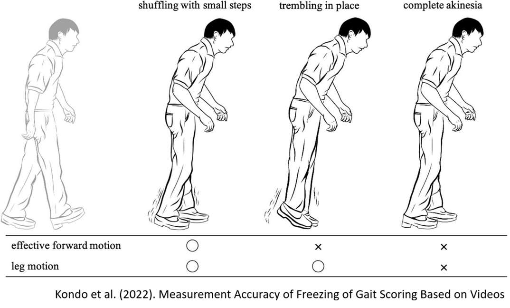

# Predicting Parkinson's Freezing of Gait

## Repository Link

https://github.com/kaSae6/fog_prediction

## Description

Goal of the [Competition](https://www.kaggle.com/competitions/tlvmc-parkinsons-freezing-gait-prediction)

The goal of this competition is to detect freezing of gait (FOG), namely its three types (start hesitation, freezing while turning, and freezing while walking). FOG is a debilitating symptom that afflicts many people with Parkinson’s disease. The data used to train the models is collected from a wearable 3D lower back sensor.

### Task Type

Prediction

### Results Summary

#### Best Model Performance
- **Best Model:** Bidirectional LSTM
- **Evaluation Metric:** Average Precision (AP)
- **Model Performance:** Total AP: 0.4456. StartHesitation: 0.0338, Turn: 0.4432, Walking: 0.0264
- **Kaggle Ranking:** #11/1379 (past competition deadline)

#### Key Insights
- **Most Important Features:** Usage of statistics (mean, median, standard deviation, minimum, and maximum) of the acceleraton timeseries, as well as using the percentiles (p15, p30, p45, p60, p75, p90).
- **Model Strengths:** The model predicts turning FOG relatively well.
- **Model Limitations:** The model does not reach sufficient prediction accuracy to be implemented in clinical care. Furthermore, the model performs badly on predicting start hestitation and walking FOG.
- **Business Impact:** This work will help researchers better understand when and why FOG episodes occur. This will improve the ability of medical professionals to optimally evaluate, monitor, and ultimately, prevent FOG events.

## Documentation

1. **[Model](Model/fog_prediction_saegner.ipynb)**
2. **[Presentation](Presentation/PD_FoG_prediction_final.pdf)**

## Cover Image

